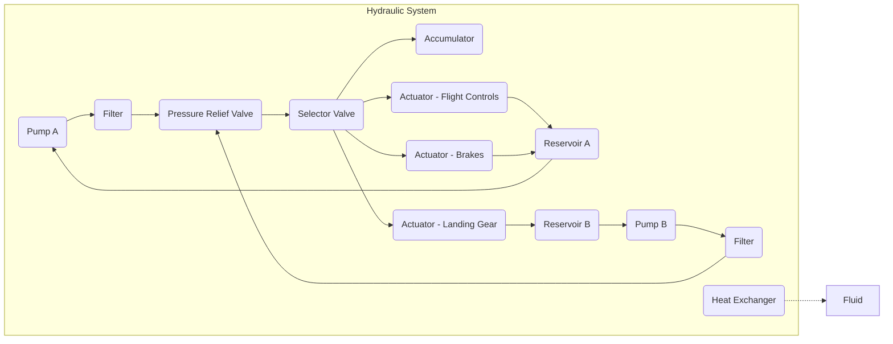

```MTL
---
dmc: DMC-GAIAPULSE-GPAM-AMPEL-0201-29-001-A-001-00_EN-US
ident:
  dmCode: GPAM-AMPEL-0201-29-001-A
  modelIdentCode: AMPEL360
  systemDiffCode: A
  systemCode: 29
  subSystemCode: 00
  subSubSystemCode: 00
  assyCode: 06  # Example Assy Code for Flight Control Algorithms
  disassyCode: 00
  disassyCodeVariant: A
  infoCode: 001  # System Description
  infoCodeVariant: A
  itemLocationCode: 00
  language: EN-US
applicability: AMPEL360XWLRGA
status: final
security: proprietary - GAIA AIR Internal Use Only
responsiblePartnerCompany: GAIAPULSE
originator: Amedeo Pelliccia & AI Collaboration
date: 2025-02-26
---
```
# GPAM-AMPEL-0201-29-001-A

## AMPEL360XWLRGA Hydraulic System (ATA 29)

**Document ID (COAFI IN):** GPAM-AMPEL-0201-29-001-A  
**Version:** 1.0  
**Date:** 2025-02-27  
**Author:** Amedeo Pelliccia & AI Collaboration  
**Status:** Final  
**Classification:** GAIA AIR Internal / Restricted

[COAFI Part II Index](../index.md)

---

## Table of Contents

1.  [29.1 Introduction](#291-introduction)
    *   [29.1.1 Purpose of Document](#2911-purpose-of-document)
    *   [29.1.2 Scope](#2912-scope)
    *   [29.1.3 Normatives and Applicable Standards](#2913-normatives-and-applicable-standards)
2.  [29.2 General Specifications of the Hydraulic System](#292-general-specifications-of-the-hydraulic-system)
    *   [29.2.1 System Overview](#2921-system-overview)
    *   [29.2.2 Technical Characteristics Table](#2922-technical-characteristics-table)
    *   [29.2.3 Principles of Operation](#2923-principles-of-operation)
    *   [Warnings, Cautions, and Notes](#warnings-cautions-and-notes)
3.  [29.3 System Architecture](#293-system-architecture)
    *   [29.3.1 General Diagram of the Hydraulic System](#2931-general-diagram-of-the-hydraulic-system)
    *   [29.3.2 Main Components](#2932-main-components)
        *   [29.3.2.1 Hydraulic Pumps](#29321-hydraulic-pumps)
        *   [29.3.2.2 Control Valves](#29322-control-valves)
        *   [29.3.2.3 Hydraulic Actuators](#29323-hydraulic-actuators)
        *   [29.3.2.4 Hydraulic Accumulators](#29324-hydraulic-accumulators)
        *   [29.3.2.5 Fluid Coolers](#29325-fluid-coolers)
    *   [29.3.3 Hydraulic Circuits](#2933-hydraulic-circuits)
    *   [29.3.4 Integration with Other Systems](#2934-integration-with-other-systems)
4.  [29.4 System Operation](#294-system-operation)
    *   [29.4.1 Normal Operating Mode](#2941-normal-operating-mode)
    *   [29.4.2 Emergency Operation Mode](#2942-emergency-operation-mode)
    *   [29.4.3 Monitoring and Diagnostic System](#2943-monitoring-and-diagnostic-system)
5.  [29.5 Maintenance Procedures](#295-maintenance-procedures)
    *   [29.5.1 Scheduled Inspections](#2951-scheduled-inspections)
    *   [29.5.2 Diagnostic Methods](#2952-diagnostic-methods)
    *   [29.5.3 Repair and Replacement Procedures](#2953-repair-and-replacement-procedures)
6.  [29.6 System Testing and Validation](#296-system-testing-and-validation)
    *   [29.6.1 Pressure and Flow Tests](#2961-pressure-and-flow-tests)
    *   [29.6.2 Fatigue and Lifecycle Tests](#2962-fatigue-and-lifecycle-tests)
    *   [29.6.3 System Integration Tests](#2963-system-integration-tests)
7.  [29.7 Safety and Compliance](#297-safety-and-compliance)
    *   [29.7.1 Failure Protection Mechanisms](#2971-failure-protection-mechanisms)
    *   [29.7.2 Certification Requirements (FAA, EASA, S1000D)](#2972-certification-requirements-faa-easa-s1000d)
    *   [29.7.3 Safety Procedures in Maintenance](#2973-safety-procedures-in-maintenance)
8.  [29.8 References and Related Documents](#298-references-and-related-documents)
9.  [29.9 How to Use This Document](#299-how-to-use-this-document)

---

## <a name="291-introduction"></a>29.1 Introduction

### <a name="2911-purpose-of-document"></a>29.1.1 Purpose of Document

This document provides a complete technical description of the hydraulic system for the AMPEL360XWLRGA aircraft, including design specifications, operation modes, maintenance procedures, and safety requirements.

### <a name="2912-scope"></a>29.1.2 Scope

Covers the design, integration, operation, maintenance, testing, and certification of the hydraulic system in accordance with S1000D, FAA FAR Part 25, EASA CS-25, and applicable aerospace standards.

### <a name="2913-normatives-and-applicable-standards"></a>29.1.3 Normatives and Applicable Standards

Relevant regulations, standards, and references include:

*   S1000D Data Module standards
*   FAA FAR Part 25
*   EASA CS-25
*   DO-160/178, ISO, ASME, NFPA
*   Internal COAFI guidelines

[Back to top](#top)

---

## <a name="292-general-specifications-of-the-hydraulic-system"></a>29.2 General Specifications of the Hydraulic System

### <a name="2921-system-overview"></a>29.2.1 System Overview

The hydraulic system provides power to critical aircraft functions, including flight controls, landing gear operations, and braking systems. It is designed with redundancy and safety in mind to ensure continuous operation under all conditions.

### <a name="2922-technical-characteristics-table"></a>29.2.2 Technical Characteristics Table

| **Parameter**              | **Value / Description**                                      |
| :------------------------- | :----------------------------------------------------------- |
| **Operating Pressure**     | 18–21 MPa (2600–3000 psi)                                    |
| **Peak Pressure**          | Up to 31 MPa (4500 psi)                                       |
| **Fluid Type**             | MIL-PRF-5606 (mineral-based)                                 |
| **Temperature Range**      | -54°C to +135°C                                               |
| **Filtration Level**       | 3 µm absolute (primary), 10 µm (secondary)                   |
| **Reservoir Capacity**     | 2 × 5 L (each reservoir)                                     |
| **System Weight**          | ~544 kg (1200 lbs)                                           |

### <a name="2923-principles-of-operation"></a>29.2.3 Principles of Operation

The hydraulic system operates by using high-pressure pumps to move hydraulic fluid from the reservoirs to actuators, controlling flight surfaces, landing gear, and braking systems. Key components include:

-   **Pumps:** Supply pressurized fluid.
-   **Filters:** Remove contaminants.
-   **Valves:** Direct flow and control pressure.
-   **Accumulators:** Dampen pressure fluctuations and provide emergency pressure.

##### **Warnings, Cautions, and Notes**

⚠ **WARNING:** Hydraulic fluid under high pressure can cause severe injury. Always follow safety protocols during maintenance.

⚠ **CAUTION:** Ensure all depressurization procedures are completed before performing repairs.

💡 **NOTE:** Regular diagnostic checks are essential to maintain system integrity.

[Back to top](#top)

---

## <a name="293-system-architecture"></a>29.3 System Architecture

### <a name="2931-general-diagram-of-the-hydraulic-system"></a>29.3.1 General Diagram of the Hydraulic System



### <a name="2932-main-components"></a>29.3.2 Main Components

#### <a name="29321-hydraulic-pumps"></a>29.3.2.1 Hydraulic Pumps

- **Type:** Variable displacement axial piston pumps  
- **Specifications:** Operating pressure up to 21 MPa; flow rate ~75 L/min  
- **Redundancy:** Dual independent pumps (Pump A and Pump B) with automatic switchover  
- **Maintenance:** Regular inspection of seals and wear components  
- **References:** AMM, Vendor Spec P/N: VPAP-001

#### <a name="29322-control-valves"></a>29.3.2.2 Control Valves

- **Types:** Pressure relief, check, selector, servo  
- **Specifications:** Rated for 31 MPa peak pressure  
- **Maintenance:** Periodic calibration and leak testing  
- **References:** CMM, IPC, Vendor Spec

#### <a name="29323-hydraulic-actuators"></a>29.3.2.3 Hydraulic Actuators

- **Types:** Linear actuators for flight controls and landing gear  
- **Specifications:** Specific stroke lengths and force outputs as per system design  
- **Maintenance:** Overhaul intervals defined in the MPD  
- **References:** AMM, Vendor Spec

#### <a name="29324-hydraulic-accumulators"></a>29.3.2.4 Hydraulic Accumulators

- **Type:** Bladder type hydraulic accumulators  
- **Precharge Pressure:** ~10 MPa  
- **Volume:** 2 L  
- **Purpose:** To dampen pressure fluctuations and provide emergency power  
- **References:** CMM, Maintenance Manual

#### <a name="29325-fluid-coolers"></a>29.3.2.5 Fluid Coolers

- **Cooling Capacity:** 10 kW (example heat rejection capacity)  
- **Cooling Method:** Air-cooled heat exchangers, utilizing ram air from dedicated NACA inlets on the fuselage  
- **Location:** Mounted in the fuselage belly, forward of the main landing gear bay  
- **References:** PDR-HYD-COOLER-001, Vendor Spec - Heat Exchangers

### <a name="2933-hydraulic-circuits"></a>29.3.3 Hydraulic Circuits

The system is divided into primary and secondary circuits to ensure redundancy:

- **Primary Circuit:** Supplies the majority of hydraulic power under normal conditions.  
- **Secondary Circuit:** Activates during pump or component failure to maintain critical functions.  
- **Load Distribution:** Managed by electronic and hydraulic logic modules.

### <a name="2934-integration-with-other-systems"></a>29.3.4 Integration with Other Systems

The hydraulic system interfaces with:

- **Electrical System:** Powers electric motor-driven hydraulic pumps and provides sensor data.  
- **Flight Control System (ATA 27):** Supplies hydraulic power to actuators, with feedback to the Flight Control Computer (FCC).  
- **Landing Gear System (ATA 32):** Powers landing gear extension/retraction and braking systems.  
- **Quantum Propulsion System (COAFI Part IV - GPPM):** May interface for auxiliary functions such as component cooling or thrust vectoring control.

[Back to top](#top)

---

## <a name="294-system-operation"></a>29.4 System Operation

### <a name="2941-normal-operating-mode"></a>29.4.1 Normal Operating Mode

**Power-Up Sequence:**

- Electrical power is applied to the aircraft.  
- Electric motor-driven hydraulic pumps activate to pre-pressurize the secondary circuit.  
- Engine-driven hydraulic pumps come online as engines reach operating speed, pressurizing the primary circuit.  
- System pressure and temperature are automatically checked by the monitoring system.  
- "HYD SYS NORMAL" indication is displayed in the cockpit.

**Normal Flight Operation:**

- **Taxi/Takeoff:** Hydraulic pressure powers brakes and flight controls.  
- **Climb/Cruise:** Pumps cycle to maintain pressure continuously.  
- **Descent/Landing:** Hydraulic system powers landing gear, flaps/slats, and braking.

**Shutdown Procedures:**

- Engines are shut down.  
- Engine-driven pumps cease operation.  
- Electric motor-driven pumps continue briefly for ground maneuvering and parking brake application.  
- System pressure is reduced and vented, and the "HYD SYS NORMAL" indication is extinguished.

### <a name="2942-emergency-operation-mode"></a>29.4.2 Emergency Operation Mode

- **Backup Pump Activation:** Automatic activation of electric motor-driven backup pumps if primary pumps fail, with manual override available.  
- **Accumulator Emergency Operation:** Accumulators provide emergency hydraulic power for:
  - **Emergency braking:** Ensuring at least one full braking application.
  - **Emergency flight control:** Limited authority for safe landing.
- **Fail-Operational Modes:** Redundancy and isolation valves maintain operation even in case of dual failures, with accumulators providing temporary support.

### <a name="2943-monitoring-and-diagnostic-system"></a>29.4.3 Monitoring and Diagnostic System

**Sensors:**

- Continuously monitor hydraulic pressure, fluid temperature, and reservoir levels.
- Display warning messages on EICAS for anomalies (low pressure, high temperature, etc.).

**Diagnostic Tools:**

- Pressure/flow testing, fluid analysis, fault code reading via the CMC, and leak detection.

[Back to top](#top)

---

## <a name="295-maintenance-procedures"></a>29.5 Maintenance Procedures

### <a name="2951-scheduled-inspections"></a>29.5.1 Scheduled Inspections

- **Daily/Pre-flight:** Visual inspections and basic pressure/flow checks.
- **Periodic:** Detailed inspections as per the Maintenance Planning Document (MPD).

### <a name="2952-diagnostic-methods"></a>29.5.2 Diagnostic Methods

- **Pressure/Flow Testing:** Verify pump output and system performance.
- **Fluid Analysis:** Check for contamination and degradation.
- **Fault Code Reading:** Using onboard diagnostic systems.
- **Leak Detection:** Visual and dye-based inspections of hydraulic connections.

### <a name="2953-repair-and-replacement-procedures"></a>29.5.3 Repair and Replacement Procedures

- **Component Overhaul:** Detailed procedures for actuators, pumps, and valves.
- **Line/Hose Replacement:** Ensure proper pressure ratings and routing.
- **Safety Precautions:** Depressurize the system, follow LOTO procedures, and reference the CMM for specifications.

[Back to top](#top)

---

## <a name="296-system-testing-and-validation"></a>29.6 System Testing and Validation

### <a name="2961-pressure-and-flow-tests"></a>29.6.1 Pressure and Flow Tests

- **Purpose:** Confirm that the hydraulic system meets performance and safety criteria.
- **Procedure:** Connect calibrated test rigs, energize pumps, and measure system pressure and flow.
- **Acceptance Criteria:** Must meet design specifications under various load conditions.

### <a name="2962-fatigue-and-lifecycle-tests"></a>29.6.2 Fatigue and Lifecycle Tests

- **Purpose:** Evaluate long-term reliability.
- **Method:** Perform cyclic pressure testing and lifecycle assessments in accordance with SAE ARP4761.

### <a name="2963-system-integration-tests"></a>29.6.3 System Integration Tests

- **Flight Control Synchronization:** Ensure hydraulic actuators respond accurately.
- **Landing Gear Operations:** Verify full retraction/extension cycles.
- **CMC Monitoring:** Validate diagnostic data consistency.

[Back to top](#top)

---

## <a name="297-safety-and-compliance"></a>29.7 Safety and Compliance

### <a name="2971-failure-protection-mechanisms"></a>29.7.1 Failure Protection Mechanisms

- **Pressure Relief Valves:** Prevent over-pressurization.
- **Redundant Pumps and Accumulators:** Ensure continuous operation.
- **Thermal Relief Valves:** Protect against overheating.
- **Backup Actuation:** Alternative methods to operate critical functions in emergencies.

### <a name="2972-certification-requirements-faa-easa-s1000d"></a>29.7.2 Certification Requirements (FAA, EASA, S1000D)

- **Regulatory Compliance:** Must adhere to FAA FAR Part 25 and EASA CS-25.
- **Safety Standards:** Follow SAE ARP4754A, ARP4761, DO-160G, and S1000D guidelines.
- **Documentation:** Cross-reference applicable certification manuals and test reports.

### <a name="2973-safety-procedures-in-maintenance"></a>29.7.3 Safety Procedures in Maintenance

- **Lockout/Tagout (LOTO):** Mandatory isolation of hydraulic power during maintenance.
- **Depressurization:** Fully vent the system before servicing.
- **Personal Protective Equipment (PPE):** Use gloves, goggles, protective clothing, and safety shoes.
- **Hazardous Fluid Handling:** Follow proper spill containment and disposal procedures.
- **Buddy System:** Employ a second technician for verification during critical tasks.

[Back to top](#top)

---

## <a name="298-references-and-related-documents"></a>29.8 References and Related Documents

### <a name="2981-technical-documentation"></a>29.8.1 Technical Documentation

- **AMM (Aircraft Maintenance Manual) ATA 29:** Covers the hydraulic system.
- **CMM (Component Maintenance Manuals):** For individual components (pumps, valves, actuators, etc.).
- **IPC (Illustrated Parts Catalog):** Parts breakdown and illustrations.
- **Vendor Specifications:** Datasheets, installation manuals, and service bulletins.

### <a name="2982-applicable-normatives"></a>29.8.2 Applicable Normatives

- COAFI Part 0 (GAIA AIR Foundation & Governance)
- COAFI Part I (GAIA PULSE ID)
- COAFI Part IV (Quantum Propulsion - for interfaces, future designs)
- FAA FAR Part 25
- EASA CS-25
- SAE ARP4754A and ARP4761
- DO-160G / DO-178C (as applicable)
- ISO 8573, ASME B31.3, NFPA 70

### <a name="2983-user-and-maintenance-manuals"></a>29.8.3 User and Maintenance Manuals

- **POH (Pilot Operating Handbook):** For flight crew procedures.
- **MPD (Maintenance Planning Document):** Scheduled maintenance tasks and intervals.
- **DDG (Dispatch Deviation Guide):** Operational guidance during hydraulic malfunctions.

[Back to top](#top)

---

## <a name="299-how-to-use-this-document"></a>29.9 How to Use This Document

This Data Module is designed for integration within the GAIA AIR COAFI documentation suite. It provides comprehensive technical details, maintenance procedures, and safety guidelines compliant with S1000D standards.

- **Cross-References:** Use linked data modules (e.g., AMM, CMM) for further details.
- **Placeholders:** Indicate where final engineering data (e.g., specific P/Ns) will be inserted.
- **Navigation:** Utilize the Table of Contents and "Back to top" links for easy access.
- **Updates:** This document will be updated periodically to reflect design revisions and regulatory changes.

[Back to top](#top)

---

*End of Document*


---
```GAIA_PDM

# AI-Driven Predictive Failure Model for Hydraulic Pumps (Simplified Technical English)

This document combines technical information and examples for an **AI-based predictive maintenance system** for **hydraulic pumps**. It explains the complete lifecycle (from design to retirement), includes sample code, best practices, and a **S1000D** XML example.

---

## 1. Hydraulic Pump Lifecycle: From Concept to Retirement

1. **Concept and Requirements**  
   - **Goal:** Define how hydraulic pumps support the system (for example, flight controls or industrial equipment).  
   - **Key Parameters:**  
     - Pump Type: Variable displacement axial piston  
     - Operating Pressure: Up to 21 MPa  
     - Flow Rate: ~75 L/min  
     - Redundancy: Two pumps (Pump A and Pump B) with automatic switchover  
   - **Regulatory Compliance:** Follow aerospace or industrial standards (FAA, EASA, ISO 4406).

2. **Design and Engineering**  
   - **CAD and Simulation:**  
     - Study fluid dynamics to improve flow efficiency  
     - Study structural limits to handle pressure  
     - Study thermal transfer to manage heat  
   - **Material Selection:**  
     - Use corrosion-resistant metals  
     - Use seals or coatings to resist wear  
   - **Integration Plan:**  
     - Define mounting, actuator connections, and system controls

3. **Prototyping and Testing**  
   - **Bench Testing:** Check pump pressure, flow, and efficiency  
   - **Environmental Tests:** Verify performance under temperature, vibration, and contamination  
   - **Failure Mode and Effects Analysis (FMEA):** Identify weak parts  
   - **Redundancy Tests:** Confirm automatic switchover reliability

4. **Manufacturing and Quality Assurance**  
   - **Production Steps:** Precision machining, assembly, and calibration  
   - **Quality Checks:** Nondestructive testing (NDT), pressure cycle testing  
   - **Traceability and Compliance:** Use serial tracking and meet vendor specs (e.g., VPAP-001)

5. **Deployment and Operation**  
   - **Installation:** Fit pumps into aircraft or industrial systems  
   - **Monitoring:**  
     - Collect sensor data (pressure, temperature, vibration)  
     - Use AI-based predictive maintenance methods  
   - **Scheduled Checks:**  
     - Inspect seals regularly  
     - Replace worn parts following the Aircraft Maintenance Manual (AMM)

6. **Maintenance and Mid-Life Upgrades**  
   - **Overhaul Intervals:** Perform disassembly and refurbishment at set times  
   - **Possible Upgrades:** Add smart sensors for real-time diagnostics

7. **Retirement and Disposal**  
   - **Retirement Guidelines:**  
     - Pump exceeds its service life  
     - Critical wear or fatigue occurs  
   - **Disassembly and Recycling:**  
     - Recycle metals  
     - Dispose of hydraulic fluids safely  
   - **Replacement Strategy:** Use new-generation pumps or electrohydraulic units

---

## 2. Extended Analysis: AI-Driven Predictive Failure Models

### 2.1 Overview
In aerospace or industrial systems, **hydraulic pumps** have critical functions. A failure can create high risks, such as loss of control or high downtime costs. An **AI-driven predictive failure model** provides:
- **Higher reliability** because of early fault detection  
- **Less downtime** because of predictive maintenance  
- **Longer operational life** because of data-based decisions  

### 2.2 Predictive Model Architecture

#### A. Data Collection and Sensors
Real-time data is important for fault prediction. Key sensors:
- **Pressure Sensors:** Detect abnormal pressure changes  
- **Temperature Sensors:** Detect overheating  
- **Vibration Sensors:** Detect alignment problems, cavitation, or bearing issues  
- **Flow Rate Sensors:** Measure volumetric efficiency  
- **Current Sensors:** Detect motor inefficiencies

**Example:** A quick drop in flow rate and a rise in pressure fluctuations can mean early-stage pump wear.

#### B. AI Model Selection and Training

1. **Supervised Learning (Labeled Data)**  
   - **Random Forest / XGBoost:** Classify failures using historical data  
   - **Neural Networks (RNN/LSTM):** Predict faults in time-series data  
   - **Support Vector Machines (SVM):** Detect abnormal patterns

2. **Unsupervised Learning (Anomaly Detection)**  
   - **Autoencoders:** Identify data that differs from normal behavior  
   - **K-Means Clustering:** Group unknown failure types  
   - **Isolation Forest:** Detect rare outlier events

3. **Reinforcement Learning (RL)**  
   - Optimize pump operation through continuous feedback  
   - Dynamically tune parameters to improve efficiency and reduce wear

#### C. Training Pipeline and Failure Prediction
1. Collect real-time and historic data  
2. Perform feature engineering (FFT for vibration, temperature peaks)  
3. Train the model on failure/non-failure data  
4. Detect anomalies outside normal operating behavior  
5. Predict failure probability (e.g., “Pump A has an 87% chance of failure within 30 operating hours”)

#### D. Predictive Maintenance Integration

- **Digital Twin:**  
  - Simulate pump performance with real data  
  - Provide live failure probability  
  - Optimize switchover between Pump A and Pump B

- **Blockchain Records:**  
  - Store performance logs securely  
  - Ensure data integrity for regulation (FAA, EASA, ISO 4406)

- **Edge AI:**  
  - Deploy models locally (on the aircraft or machinery)  
  - React instantly to anomalies without waiting for the cloud

---

## 3. Failure Modes and Prevention

| Failure Mode             | AI Detection Method                        | Preventive Action                          |
|--------------------------|--------------------------------------------|--------------------------------------------|
| Cavitation               | Vibration FFT, Pressure Fluctuation        | Change flow rate, avoid aeration           |
| Seal Wear / Leakage      | Flow inconsistency, pressure drop          | Schedule seal replacement                  |
| Bearing Fatigue          | Vibration spikes (time/frequency domain)   | Lubricate and replace in advance           |
| Overheating              | Temperature pattern analysis (RNN)         | Improve cooling                            |
| Valve Malfunction        | Flow-control anomalies detected by ML      | Replace valve early                        |

---

## 4. Model Validation and Simulation

- **Digital Twin Testing:**  
  - Simulate different conditions  
  - Train AI models in a test environment

- **Synthetic Data Generation:**  
  - Create extra training data using Generative Adversarial Networks (GANs)  
  - Reproduce rare failure events

- **Continuous Learning with Federated AI:**  
  - Train across multiple aircraft or plants  
  - Use secure model updates without sharing raw data

---

## 5. Business and Operational Impact
- **Cost Savings:** Fewer maintenance visits, less downtime  
- **Increased Safety:** Detect failures early, fix them sooner  
- **Optimized Performance:** Adjust parameters through AI  
- **Regulatory Compliance:** AI-based maintenance logs for audit

---

## 6. Implementation Roadmap

- **Phase 1: Basic Model Development**  
  - Gather historical data, train initial ML models  
  - Validate on known failures

- **Phase 2: Real-Time AI Deployment**  
  - Connect to sensors  
  - Enable anomaly detection and alerts

- **Phase 3: Advanced Optimization**  
  - Use Reinforcement Learning for autonomous tuning  
  - Deploy Digital Twin for real-time simulation

- **Phase 4: Scale and Continuous Learning**  
  - Federated AI in multiple fleets  
  - Share knowledge via secure channels

---

## 7. Example Code: Basic Predictive Model (Random Forest)

Below is example Python code showing how to create a **simple predictive model** using synthetic sensor data. In production, replace the fake data with actual sensor readings (pressure, temperature, vibration, and so on):

```python
import numpy as np
import pandas as pd
from sklearn.ensemble import RandomForestClassifier
from sklearn.metrics import classification_report, confusion_matrix
from sklearn.model_selection import train_test_split

# 1. Generate Synthetic Data
np.random.seed(42)
num_samples = 5000

pressure = np.random.normal(18.0, 1.0, num_samples)  # in MPa
temperature = np.random.normal(60.0, 5.0, num_samples)  # in °C
vibration = np.random.normal(0.02, 0.01, num_samples)  # in g
flow_rate = np.random.normal(75.0, 5.0, num_samples)  # in L/min
current_draw = np.random.normal(15.0, 2.0, num_samples)  # in A

labels = []
for i in range(num_samples):
    if (pressure[i] < 17.0 or pressure[i] > 20.0 or
        temperature[i] > 70.0 or vibration[i] > 0.03 or
        flow_rate[i] < 68.0 or flow_rate[i] > 82.0 or
        current_draw[i] > 18.0):
        labels.append(1)
    else:
        labels.append(0)

df = pd.DataFrame({
    'pressure': pressure,
    'temperature': temperature,
    'vibration': vibration,
    'flow_rate': flow_rate,
    'current_draw': current_draw,
    'failure_label': labels
})

# 2. Train/Test Split
X = df.drop('failure_label', axis=1)
y = df['failure_label']
X_train, X_test, y_train, y_test = train_test_split(
    X, y, test_size=0.2, random_state=42
)

# 3. Train the Random Forest
rf_model = RandomForestClassifier(n_estimators=100, max_depth=10, random_state=42)
rf_model.fit(X_train, y_train)

# 4. Evaluate
y_pred = rf_model.predict(X_test)
print("Confusion Matrix:")
print(confusion_matrix(y_test, y_pred))
print("\nClassification Report:")
print(classification_report(y_test, y_pred))

# 5. Predict Failure Probability
new_sample = np.array([[19.0, 65.0, 0.025, 73.0, 16.0]])
failure_probability = rf_model.predict_proba(new_sample)[0][1]
print(f"\nFailure Probability: {failure_probability:.2%}")
```

### Interpretation and Next Steps
1. **Use Real Data:** Replace synthetic data with real operational data from pumps.  
2. **Feature Engineering:** Analyze vibration frequencies or other advanced signals.  
3. **Edge Deployment:** Convert the model to ONNX or TensorFlow Lite for local devices.  
4. **Digital Twin Approach:** Combine real data with simulated scenarios for robust detection.

---

## 8. S1000D Document Example (Simplified)

This is a **sample XML** that shows how to document an **AI-based predictive failure model** for hydraulic pumps in **S1000D**. It is a **simplified** version. Adapt it to your unique business rules and data module coding standards.

```xml
<?xml version="1.0" encoding="UTF-8"?>
<dmodule xmlns="http://www.s1000d.org/S1000DSchema" 
         xmlns:xsi="http://www.w3.org/2001/XMLSchema-instance"
         xsi:schemaLocation="http://www.s1000d.org/S1000DSchema S1000D_5-0-1.xsd">

    <identAndStatusSection>
        <dataModuleIdent>
            <dmCode modelIdentCode="GAIA-AI"
                    systemDiffCode="A"
                    systemCode="29"
                    subSystemCode="10"
                    subSubSystemCode="00"
                    infoCode="001"
                    infoVerCode="A"
                    itemLocationCode="000"
                    disassemblyCode="A"
                    languageCode="EN"
                    issueNumber="001"
                    securityClassificationCode="01"/>
            <language>EN</language>
            <issueInfo>
                <issueNumber>001</issueNumber>
                <date>2025-02-26</date>
            </issueInfo>
            <title>AIRCRAFT HYDRAULIC PUMP – AI-DRIVEN PREDICTIVE FAILURE MODEL</title>
        </dataModuleIdent>
        <issueInfo>
            <issueNumber>001</issueNumber>
            <inWork>IN WORK</inWork>
        </issueInfo>
        <responsiblePartnerCompanyCode>GAIA</responsiblePartnerCompanyCode>
        <originator>GAIA AIR Engineering</originator>
        <applicCrossRef>
            <applicRef>
                <modelIdentification>GAIA Series 1000</modelIdentification>
            </applicRef>
        </applicCrossRef>
    </identAndStatusSection>

    <content>
        <description>
            <title>System Overview</title>
            <para>
                The hydraulic pump system uses two variable displacement
                axial piston pumps (Pump A and Pump B). The system has an
                operating pressure of up to 21 MPa and a flow rate
                of about 75 L/min...
            </para>
            <para>
                An AI-based predictive failure model collects real-time sensor
                data (pressure, temperature, vibration, flow rate, and current).
                It predicts failures with both supervised and unsupervised approaches.
            </para>
        </description>
        <description>
            <title>Failure Modes and Preventive Actions</title>
            <para>
                <table tableId="failure-modes-table">
                    <tgroup cols="3">
                        <thead>
                            <row>
                                <entry>Failure Mode</entry>
                                <entry>AI Detection Method</entry>
                                <entry>Preventive Action</entry>
                            </row>
                        </thead>
                        <tbody>
                            <row>
                                <entry>Cavitation</entry>
                                <entry>Vibration FFT, Pressure Fluctuation</entry>
                                <entry>Adjust Flow Rate, Avoid Aeration</entry>
                            </row>
                            <!-- ... more rows ... -->
                        </tbody>
                    </tgroup>
                </table>
            </para>
        </description>
        <!-- ... more content ... -->
    </content>

    <metadataSection>
        <qualityAssurance>
            <revisionLevel>Unclassified</revisionLevel>
        </qualityAssurance>
        <securitySection>
            <classification>Unclassified</classification>
        </securitySection>
    </metadataSection>
</dmodule>
```

### Key S1000D Elements
- **dmCode:** Unique data module identifier  
- **identAndStatusSection:** Includes metadata (date, title, version)  
- **content:** Holds technical details, tables, and references  
- **metadataSection:** Includes QA level, security status, and more  

---

## 9. Best Practices and Next Steps

1. **Set Data Module Codes:** Follow your CSDB rules.  
2. **Integrate into S1000D Publications:** Or use an Interactive Electronic Technical Publication (IETP).  
3. **Link to Maintenance Tasks:** Cross-reference with AMM procedures (e.g., Chapter 29).  
4. **Version Control:** Update data modules when the AI model changes.  
5. **Adapt to ATA iSpec 2200:** If you need older or different aerospace specs.

---
```
## Conclusion

This single **markdown** document describes:
- **Hydraulic pump specs** and lifecycle steps  
- An **AI-driven predictive model** for maintenance (including code samples and best practices)  
- A **S1000D example** for formal documentation in aerospace

With **predictive AI**, organizations can:
- **Reduce unexpected failures**  
- **Cut maintenance costs**  
- **Improve operational safety**

To implement successfully, gather real sensor data, validate the model (testing, digital twin, synthetic data), and adopt official documentation practices (S1000D or ATA). Then maintain continuous learning (federated AI) to keep the model current with real-world conditions.

````
## How to Use This Document

This Data Module is designed to be used in conjunction with the GAIA AIR COAFI documentation suite. It provides all necessary technical details, maintenance procedures, and safety guidelines in a format that complies with S1000D. Users are encouraged to refer to cross-linked documents for further information and to utilize the "Back to Table of Contents" links provided at the end of each major section for ease of navigation.

---

*End of Document*
